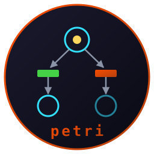

# petri



**Terminal Petri net player. Written in Rust.**

   

Describe a Petri net in a few lines of plain text. Watch the marking, fire transitions by hand, or let a random run resolve the conflicts. Analyze the reachable state space for deadlocks and place bounds. Conflicts are marked with `‼`: two enabled transitions competing for the same tokens. The net cannot decide which fires. You do.

Built on [crust](https://github.com/isene/crust). Part of the [Fe₂O₃ Rust terminal suite](https://github.com/isene/fe2o3).

## Build

```bash
cargo build --release
```

## Net format

Two line shapes matter; every other line (headings, indentation, prose) is ignored, so a [HyperList](https://isene.org/hyperlist/)-shaped file parses as-is:

```
# Mutual exclusion — two processes, one lock
idle1 = 1                       # place with initial tokens
idle2 = 1
lock  = 1

enter1: idle1 lock -> crit1     # transition: inputs -> outputs
exit1:  crit1 -> idle1 lock
enter2: idle2 lock -> crit2
exit2:  crit2 -> idle2 lock
```

Places auto-declare by appearing in a transition (0 tokens). Repeat a place for arc weight (`t: p p -> q` consumes two tokens). Empty side = source/sink (`-> p` generates, `p ->` consumes). The transition name is optional.

Run it: `petri mutex.net` — or just `petri` for a built-in demo.

## Keys

| Key | Action |
|---|---|
| `Tab` | switch focus (places / transitions) |
| `j k` / arrows | move selection |
| `Enter` / `f` | fire the selected transition |
| `Space` | auto-run: fire random enabled transitions (any key stops) |
| `+` / `-` | add / remove a token on the selected place |
| `u` / `R` | undo last firing / reset to initial marking |
| `a` | analyze: reachable markings, deadlocks, boundedness, place bounds |
| `e` | edit the net file in `$EDITOR`, reload on return |
| `?` | help · `q` quit |

Enabled transitions show `▶`. Conflicting ones show `‼`. When nothing is enabled, the status bar declares DEADLOCK.

## Analysis

`a` (or headless: `petri --analyze file.net`) explores the reachable markings breadth-first (capped at 50k in the TUI, 200k headless) and reports:

- reachable marking count (and whether the cap truncated it)
- boundedness (k-bounded, "safe" when 1-bounded)
- deadlocks: count plus example dead markings
- per-place token bounds

Headless exit codes: `0` clean, `2` deadlock reachable — usable in scripts and CI.

```
$ petri --analyze examples/philosophers.net
examples/philosophers.net: 8 places, 6 transitions
 Reachable markings: 6
 Bounded: yes (1-bounded — safe)
 Deadlocks: 1 dead marking(s) reachable!
   dead: has1 has2
```

## Examples

- `examples/mutex.net` — two processes, one lock; a pure conflict.
- `examples/prodcons.net` — bounded buffer; live, deadlock-free, 3-bounded.
- `examples/philosophers.net` — two dining philosophers; the analysis finds the starvation deadlock.

## Why

Petri nets are lawful systems that refuse to be clockwork. The firing rule is fully formal, yet a conflict is a branch point the formalism itself cannot close: both continuations are lawful, and the theory declines to pick. This little tool lets you put your finger on that point and press it. Background: [isene.org/freewill](https://isene.com/freewill/).

## License

Unlicense (public domain).
